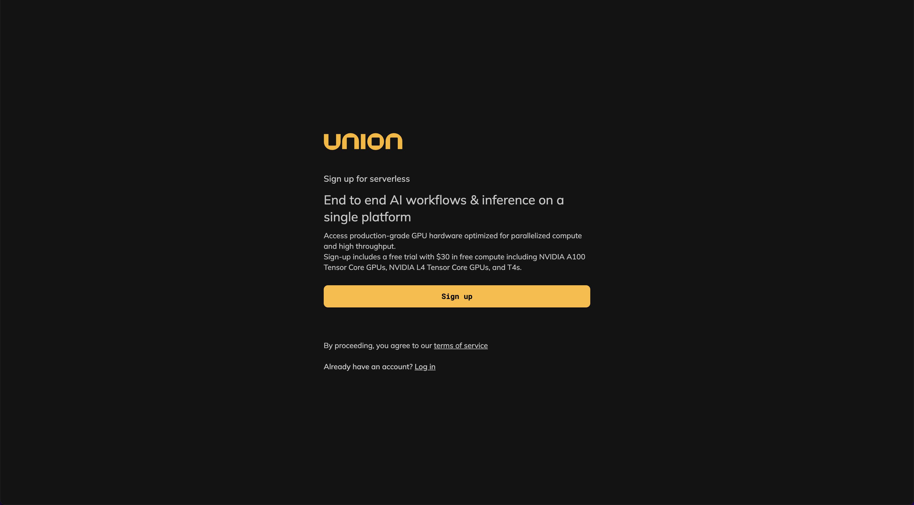
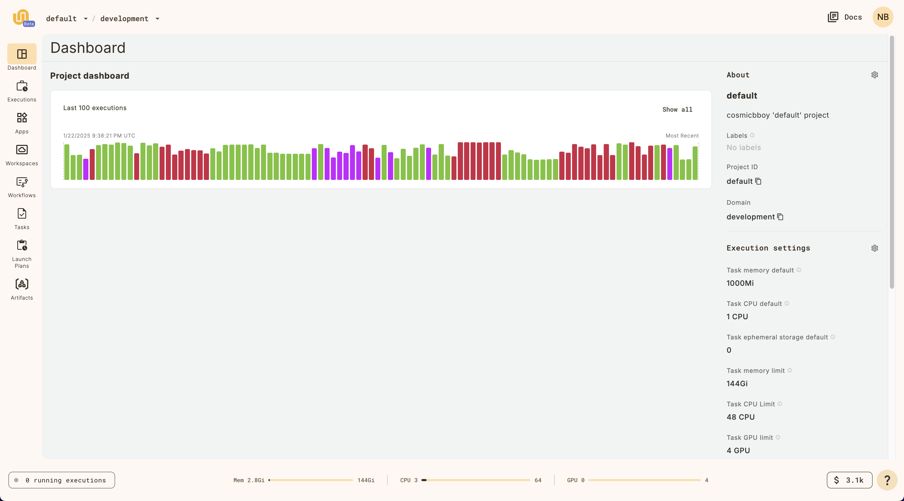
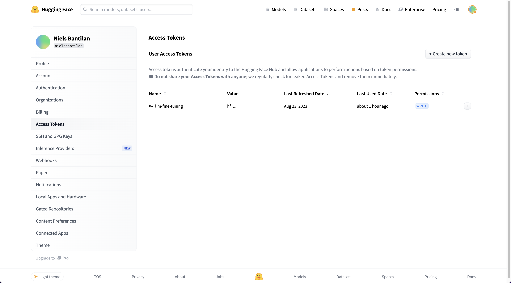

# 📖🦙 NotebookLM Clone based on Llama Open Weights Models

This repo contains an open source implementation of NotebookLM that runs on Union. This repo
adapts the [NotebookLlama](https://github.com/meta-llama/llama-cookbook/tree/main/end-to-end-use-cases/NotebookLlama) example in Meta's
[`llama-cookbook`](https://github.com/meta-llama/llama-cookbook) repo.

- 🌠 Workshop slides: https://go.union.ai/workshop-notebook-lm-clone
- 📱 Example app: https://square-sound-0c70d.apps.serverless-1.us-east-2.s.union.ai/

## Prerequisites

To run this workshop, first you need a [Github account](http://www.github.com/).

Then, create Union Serverless account [here](https://signup.union.ai/).



Once you've signed up, going to the [Union dashboard](https://serverless.union.ai/)
should look something like this:



On the bottom right, you should see that you have `$ 30` in credits, which is
sufficient for running this workshop.

Next, if you don't already have one, create a [HuggingFace](https://huggingface.co/)
account. On the HuggingFace website, then, create a HuggingFace API key
[here](https://huggingface.co/settings/tokens).



If you don't already, request access to the [Llama 3.2 3B model](https://huggingface.co/meta-llama/Llama-3.2-3B-Instruct)
and [Llama 3.2 1B model](https://huggingface.co/meta-llama/Llama-3.2-1B-Instruct).

## Workshop

If you're here for the workshop, head over to the Google colab notebook here:

<a target="_blank" href="https://colab.research.google.com/github/unionai-oss/notebook-llama/blob/main/workshop.ipynb">
  
</a>

Follow the steps below to run the contents of this repo from a CLI.


## Create your environment

Pull the repo:

```bash
$ git clone https://github.com/unionai-oss/notebook-llama
$ cd notebook-llama
```

Create a virtual environment

```bash
$ python3 -m venv .venv
$ source .venv/bin/activate
```

Install the requirements:

```bash
$ pip install -r requirements.txt
```

This will install the `union` SDK.

### Create a secret on Union

Authenticate the workspace session:

```bash
$ union create login --auth device-flow --serverless
```

Then create Union secret for the HuggingFace API key we created in the step above:

```bash
$ union create secret huggingface_api_key
```

You should see a `Enter secret value:` prompt to paste on the secret value.
his will create a secret in Union with the name `huggingface_api_key`.


## Quickstart

Run the workflow with a PDF file from a URL:

```bash
$ union run --remote notebook_llama/pdf_to_podcast.py pdf_to_podcast --pdf_path https://arxiv.org/pdf/2503.10865
```

Run the workflow with a local PDF file:

```bash
$ union run --remote notebook_llama/pdf_to_podcast.py pdf_to_podcast --pdf_path data/544593v2.full.pdf
```

## Serve the UI App

First, create Union API key called `notebook-llama` for app serving

```bash
$ union create api-key admin --name notebook-llama
```

You can list the api keys you have with:

```bash
$ union get api-key admin
```

Then, create an Union API key for the `notebook-llama` app:

```bash
$ union create secret union_api_key
```

Deploy the streamlit app:

```bash
$ union deploy apps app.py notebook-llama-streamlit
```
